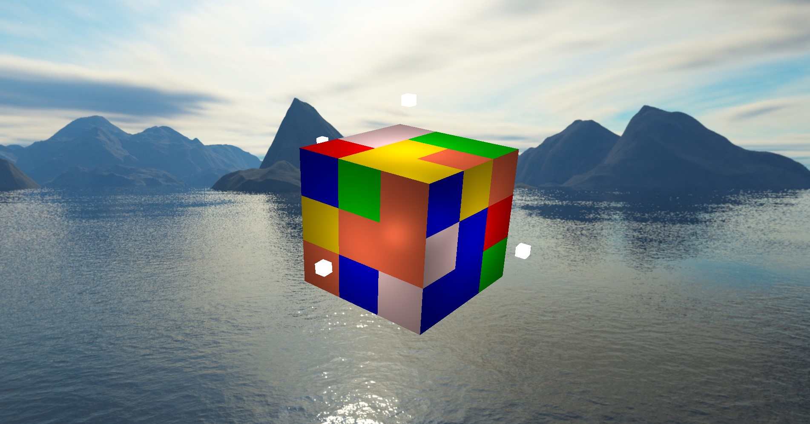

# Rubiks Cube 
This is the self-project for IS305, 2021 spring.  
Using OpenGL to render a Rubiks Cube.

## Version 1
Using GL/gl.h, which is easy to use in certain aspects, however, this lib has too many restrictions which limit further optimizations and further development. As a consequence, 
I will turn to glad in the next version, despite of the fact that I only have little time to develop this project.

## Version 2
Using glad to render 27 blocks in order to construct the cube. Render a skybox for background.  

For temporary, I only use one point light. For further development, there are still many details which can be optimized. However, because of poor performance in rendering, it seems that my computer cannot work on well with these jobs. As a result, further development will be random. 

On the other hand, I will make some optimization on coding style and more functions.

Current effect is as follows.

## Keyboard instructions
- `R`: rotate right face
- `L`: rotate left face
- `F`: rotate front face
- `B`: rotate back face
- `U`: rotate up face
- `D`: rotate down face

- `Up`: Pitch up
- `Down`:Pitch down
- `Right`: Change Yaw
- `Left`: Change Yaw

- `1-6`: Change deltaX-Z
-`0`: reset position

- `mouse_left button`: camera rotate
- `mouse scroll`: move camera position

**Todo List**  
- [ ] Edge display
- [x] skybox render 
- [x] Human-computer interaction page
- [x] generate a random state cube
- [ ] State reset
- [ ] Generate random state with one click
- [x] read state from file and generate cube based on it
- [ ] auto-solve method
- [x] Optimize URF move
- [x] Using dialog box to show error messages
- [x] Light
- [ ] Light turn on and ture off
- [ ] light color change
- [ ] Anti aliasing
- [x] Material: Pearl
- [x] Material change
- [x] Multiple light
- [ ] Bloom
- [ ] shadow
- [ ] FrameBuffers
